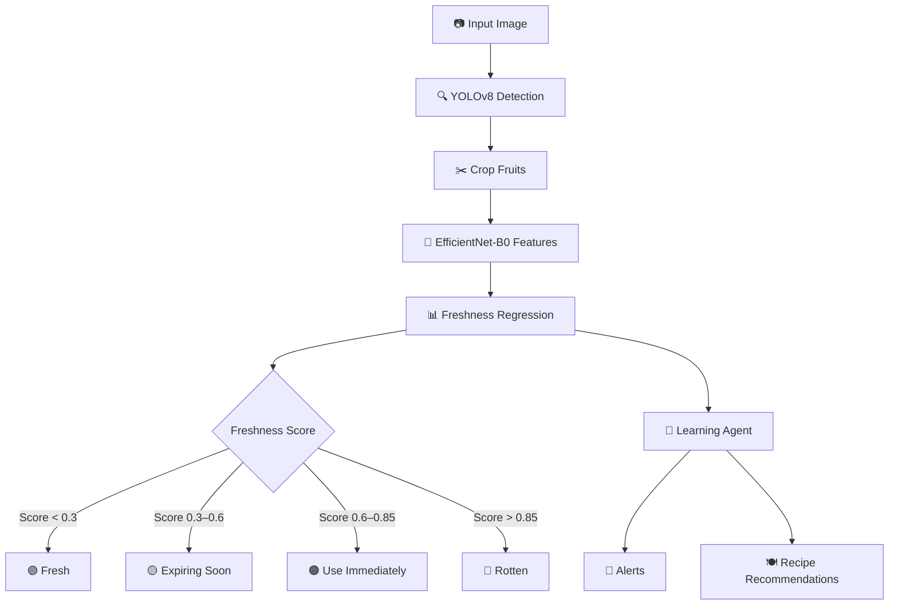

<!-- Click ctrl + shift + v for better view -->


<div align="center">


# 🌿 FreshSense AI

### Agentic Food Freshness Detection & Recipe Recommendation System

[](https://python.org)
[](https://ultralytics.com)
[](https://tensorflow.org)

*An end-to-end computer vision pipeline that detects fruits, predicts freshness, tracks shelf life dynamically, and recommends recipes — reducing food waste intelligently.*

[Overview](#-overview) · [Architecture](#-system-architecture) · [Models](#-models) · [Datasets](#-datasets) · [Learning System](#-learning-system) · [Future Scope](#-future-scope)

</div>

---

## 📌 Overview

Food waste often begins at home — not from negligence, but from lack of awareness. **FreshSense AI** bridges that gap with a fully agentic computer vision pipeline that monitors your food in real time.

| Capability | Description |
|---|---|
| 🍓 **Fruit Detection** | Real-time multi-object detection via YOLOv8 |
| 📊 **Freshness Scoring** | Regression-based freshness prediction (0 → 1) |
| ⏳ **Shelf Life Tracking** | Dynamic learning agent updates predictions from observations |
| 🍽️ **Recipe Recommendations** | Urgency-prioritized suggestions to minimize waste |

---

## ❗ Problem Statement

> **Insight:** There is no unified system that tracks food freshness dynamically and suggests timely, intelligent actions.

- ❌ Humans cannot accurately identify early-stage spoilage
- ❌ No real-time freshness monitoring exists for home use
- ❌ No intelligent system recommends consumption before waste occurs

---

## 💡 Solution

A complete **Agentic AI pipeline** — from raw image to actionable recommendation:

```
📷 Image Input
    └── 🔍 YOLOv8 Object Detection
            └── ✂️ Crop Detected Fruits
                    └── 🧠 EfficientNet-B0 Feature Extraction
                                └── 📊 Freshness Score (Regression)
                                            └── 🤖 Learning Agent (Shelf Life Update)
                                                        └── 🔔 Alerts + 🍽️ Recipe Suggestions
```

---

## 🏗️ System Architecture

### Pipeline Flow



---

## 🔍 Models

### Object Detection — YOLOv8x

| Property | Detail |
|---|---|
| Parameters | ~68M |
| Speed | Real-time inference |
| Detection | Multi-object, single-pass |
| Output | Bounding box + class label |

**Architecture:**

```
Input Image
    └── 🧱 Backbone   →  Deep feature extraction
            └── 🔗 Neck       →  Multi-scale feature fusion (FPN/PAN)
                    └── 🎯 Head       →  Bounding box + class prediction
```

---

### Freshness Prediction — EfficientNet-B0 + Custom CNN Head

- **Input:** Cropped fruit image
- **Output:** Freshness score ∈ [0, 1] — where `0 = Fresh`, `1 = Rotten`
- **Task Type:** Regression

**Custom Head Architecture:**

```
EfficientNet-B0 Backbone
    └── Dropout
            └── Linear → ReLU
                    └── Dropout
                            └── Linear → ReLU
                                    └── Linear → Sigmoid → Freshness Score
```

---

## 📊 Datasets

### 🍓 Detection Dataset
- **Source:** Fruits & Vegetables — Kaggle LVIS subset
- **Diversity:** Varying lighting conditions, angles, and complex backgrounds
- **Purpose:** Trains YOLOv8 to localize fruits in real-world scenes

### 🍌 Freshness Dataset
- **Source:** Fruit Freshness dataset — Kaggle
- **Fruits Covered:**

  | 🍎 Apple | 🍇 Grapes | 🍋 Lemon | 🥭 Mango |
  |---|---|---|---|
  | 🍓 Strawberry | 🍅 Tomato | 🍉 Watermelon | 🧡 Papaya |
  | 🫑 Paprika Pepper | — | — | — |

- **Structure:** Time-series decay images from Day 0 → Day N, enabling regression over the spoilage curve

---

## 🔥 Learning System

> **Core Innovation:** The system doesn't just predict — it *learns* from real-world usage and continuously improves its own estimates.

### 1️⃣ Frame-Level Smoothing

Prevents erratic frame-to-frame fluctuations by applying exponential smoothing:

```
final_day = α × CNN_day + (1 − α) × expected_day
```

### 2️⃣ Shelf-Life Learning Agent

Updates predicted shelf life using observed spoilage timelines:

```
observed_life = last_seen_day − first_seen_day

error = observed_life − predicted_shelf_life

new_shelf_life = predicted_shelf_life + α × error × confidence
```

**Benefits:**
- 🔄 Continuously improves predictions over time
- 📉 Reduces sudden freshness-score fluctuations
- 🧠 Personalizes to storage conditions and environment

---

## 🔔 Alert System

| Status | Score Range | Action |
|---|---|---|
| 🟢 **Fresh** | 0.00 – 0.30 | ✅ Safe to consume — no action needed |
| 🟡 **Expiring Soon** | 0.30 – 0.60 | ⏳ Plan usage within 1–2 days |
| 🟠 **Use Immediately** | 0.60 – 0.85 | ⚠️ High priority — cook or consume today |
| 🔴 **Rotten** | 0.85 – 1.00 | ❌ Discard safely |

---

## 🍽️ Recipe Recommendation

Recipes are prioritized dynamically based on items closest to spoilage, ensuring maximum utilization before waste:

| Recipe Type | Best For |
|---|---|
| 🥤 Smoothies | Overripe fruits, soft texture |
| 🧃 Juices | Slightly past peak freshness |
| 🥗 Fruit Salads | Mixed ripeness levels |

---

## 📈 Future Scope

- [ ] 🥦 Extend support to vegetables, dairy, and packaged foods
- [ ] 🧊 IoT integration with smart refrigerators
- [ ] 📊 Larger, more diverse datasets for improved accuracy
- [ ] 📱 Mobile application deployment (iOS & Android)
- [ ] 🌐 Cloud dashboard for household food inventory tracking

---

## 👨‍💻 Author

<table>
  <tr>
    <td align="center">
      <b>Balla Sandeep Sankar</b><br/>
      <a href="https://github.com/Balla-Sandeep-Sankar-NITW">Balla Sandeep Sankar</a>
    </td>
  </tr>
</table>

---

## ⭐ Key Highlights

- 🚀 **End-to-end Agentic AI system** — fully automated from image to recommendation
- 🤖 **Computer Vision + Adaptive Learning** — predictions improve with real-world usage
- 🌍 **Real-world impact** — directly targets household food waste reduction
- 🏠 **Scalable** — architected for smart home and IoT ecosystem integration

---

<div align="center">

*If you found this useful, consider giving it a ⭐ — it helps others discover the project!*

</div>
